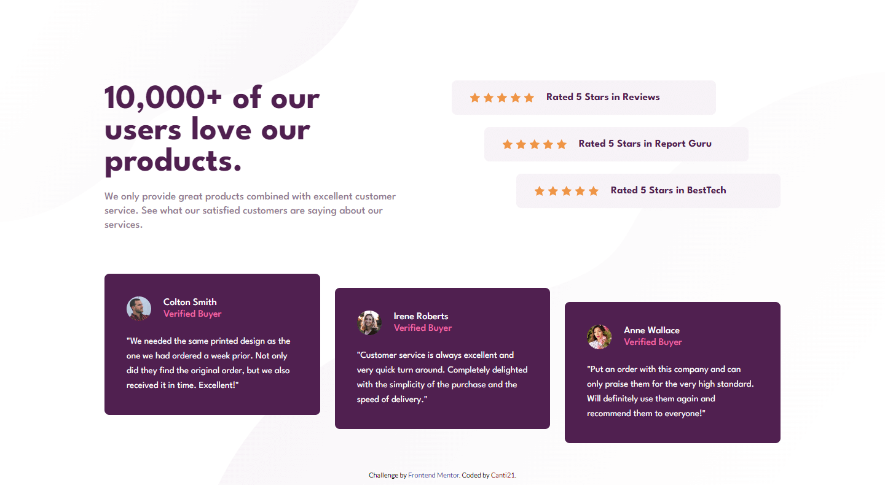
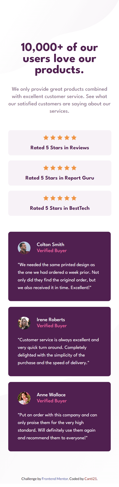

# Frontend Mentor - Social proof section solution

This is a solution to the [Social proof section challenge on Frontend Mentor](https://www.frontendmentor.io/challenges/social-proof-section-6e0qTv_bA). 

## Table of contents

- [Overview](#overview)
  - [The challenge](#🎯-the-challenge)
  - [Screenshots](#📷-screenshots)
  - [Links](#🔗-links)
- [Built with](#🛠-built-with)
- [Author](#🐱‍👤-author)

## Overview

### 🎯 The challenge

Users should be able to:

- View the optimal layout for the section depending on their device's screen size

The target designs are in the [`/design`](./design/) folder.

### 📷 Screenshots

**Here is the final product**

🖥️ Desktop View:

📱 Mobile View:

### 🔗 Links

- Solution URL: [FrontEnd Mentor](https://www.frontendmentor.io/solutions/social-proof-section-8o4EqBNOZE)
- Live Site URL: [Deploy](https://canti21.github.io/FEM-social-proof-section/)

## 🛠 Built with

- Semantic HTML5 markup
- CSS custom properties
- Flexbox
- CSS Grid
- Mobile-first workflow

## 🐱‍👤 Author

- Frontend Mentor - [@Canti21](https://www.frontendmentor.io/profile/Canti21)
- Twitter - [@Canti2100](https://www.twitter.com/Canti2100)
